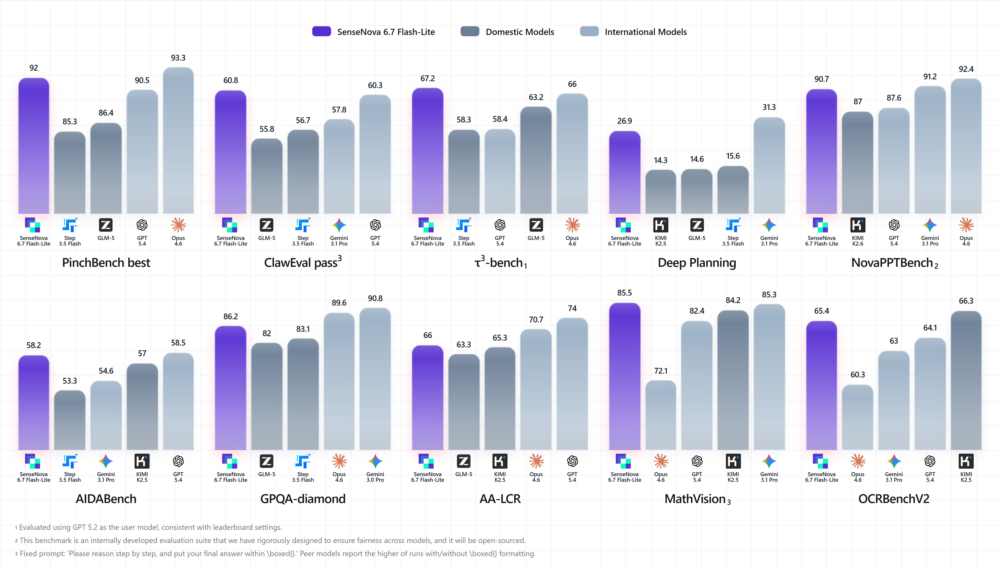

# ⚡ SenseNova 6.7 Flash-Lite

🌐 **English** | [中文](README_CN.md)

<p align="center">
  <a href="https://platform.sensenova.cn/"></a>
</p>

<p align="center">
  <a href="https://platform.sensenova.cn/"><b>🌐 Official Website — platform.sensenova.cn</b></a>
</p>

> A natively multimodal LLM, better tuned for office work and more token-efficient.

**SenseNova 6.7 Flash-Lite** is SenseTime's lightweight multimodal agent model, purpose-built for real-world workflows. With a native multimodal architecture that balances quality and cost, it reliably powers complex long-horizon office tasks such as data analysis, slide deck generation, deep research reports, and infographic creation.

---

## ✨ Core Capabilities

The latest natively multimodal model from SenseTime — capable of complex office tasks including data analysis, deep research, sophisticated image understanding, and PPT generation. Token Plan is now available: faster, better, cheaper.

### 🖼️ 1. Native Multimodal Agent

Equip your agent with native vision so it can share your "field of view".

### 🔗 2. Tuned for Enterprise Office Work

Comfortably handles long-horizon, multi-step office tasks — data analysis, PPTs, deep research, and infographics are all in scope.

### 💰 3. ~60% Token Savings

Compared with text-only agents, scenarios such as information search consume around 60% fewer tokens.

> **Note:** Estimated on average across long-horizon complex tasks against leading agent models on the market; actual savings vary by task.

---

## 📊 Benchmarks

<p align="center">
  
</p>

---

## 🔥 Showcase

### 🏢 Integrated Office Workflow

Taking semiconductor memory market analysis as an example, the model covers the entire pipeline from data insight to industry research to content delivery:

**Data Insight → Industry Research → Content Delivery**

<p align="center">
  
</p>

The agent runs the full "read → think → do → deliver" loop on real office tasks. Below are three representative cases with their deliverables.

#### 📊 Data Analysis ｜ Cleaning and Trend Analysis on Memory Chip Quotes

> 💬 **Query**: Read `汇总.csv` and clean / analyze the recent memory chip quote data.

**🧠 Agent Conclusion**

Memory prices have been trending upward overall, with select DRAM and NAND products showing the largest gains. The inflection point appeared in late February, followed by an acceleration through March. Categories diverged sharply — server-grade products outperformed consumer ones — indicating that this rally is not uniform but is being led by key categories.

📄 [*Memory Price Analysis.pdf*](https://github.com/OpenSenseNova/SenseNova-Skills/blob/main/examples/memory-price-end2end-analysis/README.md#step-1-data-analysis)

---

#### 🔬 Deep Research ｜ Drivers Behind 2026 Memory & Flash Price Volatility

> 💬 **Query**: Based on the data analysis, investigate the main drivers of memory and flash price movements since the start of 2026.

**🧠 Agent Conclusion**

The current rally is driven by a combination of supply contraction, surging AI-server demand, and deliberate output discipline by some manufacturers. In the short term, sentiment and inventory restocking amplify volatility, but over the medium term it looks more like a structural rebalancing of supply and demand. If high-end demand persists and OEMs maintain a cautious supply stance, prices may continue to rise or stay elevated.

📄 [*Memory Price Research.pdf*](https://github.com/OpenSenseNova/SenseNova-Skills/blob/main/examples/memory-price-end2end-analysis/README.md#step-2-deep-research) · Research · Report

---

#### 🎨 PPT Creation ｜ 15–20-page Memory Price Volatility Report

> 💬 **Query**: Generate a 15–20 page Chinese PPT titled "2026 Memory Price Volatility Analysis & Market Outlook".

**🧠 Agent Conclusion**

The final deck follows a clear narrative: first prove with data that "prices are indeed rising and the gains are concentrated in key categories", then explain "why and what's driving it" via external research, and finally give a forward-looking judgement plus actionable recommendations — focus on high-momentum categories, lock in procurement timing, and continuously track OEM strategy and downstream demand.

📄 [*Semiconductor Memory Market Surge*](https://github.com/OpenSenseNova/SenseNova-Skills/blob/main/examples/memory-price-end2end-analysis/README.md#step-3-ppt-generation) · PPT · Showcase

> 💡 **Note**: The above capabilities **must be delivered by the Agent framework together with Skills** — calling the model API directly cannot reproduce the full workflow.
>
> - **Recommended path**: Use our [Agent Pack](https://github.com/SenseTime-FVG/agent_pack) one-click installer for Hermes Agent / OpenClaw — **the full Skills suite is bundled** and works out of the box (see [🤖 Using with Open-Source Agent Frameworks](#-using-with-open-source-agent-frameworks) below).
> - **Self-integration**: For other agent frameworks, grab Skills directly from [OpenSenseNova/SenseNova-Skills](https://github.com/OpenSenseNova/SenseNova-Skills) and install them yourself.

---

## 🚀 Quick Start

### Apply for an API Key

1. Register and complete identity verification at [https://console.sensecore.cn](https://console.sensecore.cn).
2. From the console sidebar, go to **Management Center → API Key Management → Create API Key**, then copy and store it safely (the full key is shown only once on creation).
3. Set the environment variable:
   ```bash
   export SENSENOVA_API_KEY="your_api_key_here"
   ```

### ⚡ Make Your First Call

**curl**

```bash
curl 'https://token.sensenova.cn/v1/chat/completions' \
  -H "Authorization: Bearer $SENSENOVA_API_KEY" \
  -H 'Content-Type: application/json' \
  -d '{
    "model": "sensenova-6.7-flash-lite",
    "max_tokens": 2000,
    "messages": [{"role": "user", "content": "Hi, please briefly introduce yourself."}]
  }'
```

---

## 🤖 Using with Open-Source Agent Frameworks

SenseNova 6.7 Flash-Lite is OpenAI-API compatible and integrates seamlessly with mainstream open-source agent frameworks.

### 🛠️ Hermes Agent and OpenClaw

**Hermes Agent** and **OpenClaw** are local agent frameworks built for real office tasks.

We recommend deploying via the one-click installer at [SenseTime-FVG/agent_pack](https://github.com/SenseTime-FVG/agent_pack).

The installer collects LLM credentials during setup and writes them automatically to the relevant config files (`~/.hermes/config.yaml` and `~/.openclaw/openclaw.json`).

Visit the [Releases page](https://github.com/SenseTime-FVG/agent_pack/releases) to download the installer for your platform (Windows `.exe` / macOS `.pkg` / Linux script) for an out-of-the-box experience.

> ⚠️ **Skills required**: Hermes Agent and OpenClaw must be paired with the official skill library [OpenSenseNova/SenseNova-Skills](https://github.com/OpenSenseNova/SenseNova-Skills) to unlock the full office-task capabilities.


#### [💻 Detailed Windows install & usage →](docs/install-windows.md)

#### [🍎 Detailed macOS install & usage →](docs/install-macos.md)


### 🚀 Getting Started

#### Hermes Agent (CLI AI assistant)

After installation the Hermes chat terminal usually opens automatically. If not, open any terminal (use `wsl` on Windows, system terminal on macOS / Linux) and run:

```bash
hermes
```

You'll land in the chat interface. Try asking things like:

- "Write me a Python script that renames every `.jpg` in the current directory to `photo-1.jpg`, `photo-2.jpg`, …"
- "Why does this code throw an error? `<paste code>`"
- "What's new in React 18?"

To exit, type `/exit` or press `Ctrl + C`.

#### OpenClaw (web UI)

After installation the OpenClaw gateway starts in the background and a browser tab usually opens automatically at something like:

```
http://localhost:18789/#token=xxxxx
```

If it doesn't, run from the terminal:

```bash
openclaw dashboard
```

The web UI lets you:
- Browse all AI conversation history
- Manage API keys
- Configure different models
- Inspect metrics and logs

### [❓ FAQ →](docs/faq.md)

#### 📮 Feedback & Support

For bug reports or feature requests, reach us via:

- **GitHub Issues**: [SenseTime-FVG/agent_pack](https://github.com/SenseTime-FVG/agent_pack/issues) — for bug reports and feature requests
- **Hermes official docs**: <https://github.com/NousResearch/hermes-agent>
- **OpenClaw official docs**: <https://docs.openclaw.ai>

To help us triage faster, please include the following in your issue:

1. **OS version**: e.g., Windows 11, macOS 14, Ubuntu 22.04
2. **Reproduction steps**: where exactly the issue occurs
3. **Full log**: log paths are listed in [FAQ](docs/faq.md) Q1

---

### [🎓 Advanced Guide →](docs/advanced.md)

---

## 💎 Token Plan

**SenseNova Token Plan** is built for complex knowledge work and office production scenarios — not just "cheap to use" but "comfortable to use": curated, more efficient models paired with generous quota guarantees so even long-running tasks can run with confidence.

| Feature | Description |
|------|------|
| More efficient | Token consumption on complex tasks is dramatically reduced, raising delivery output per unit cost |
| More capable | Handles cross-step, cross-modal, cross-page information processing and content generation |
| More stable | Tuned for office scenarios — outputs hew closely to real workflows |
| More complete | Closes the loop from "understanding the task" to "producing the final deliverable" |

<p align="center">
  
</p>

> The latest SenseNova 6.7 Flash-Lite model and the full cowork-skill lineup are now part of the **Little Raccoon Pro plan**, offering enterprise-grade security plus a smooth out-of-the-box experience.<!-- TODO: link to Little Raccoon product page -->

<!-- TODO: link to Token Plan purchase / details page -->

---

## 📚 Related Links

- Website: [https://platform.sensenova.cn/](https://platform.sensenova.cn/)
- API documentation: [docs/API.md](docs/API.md)
