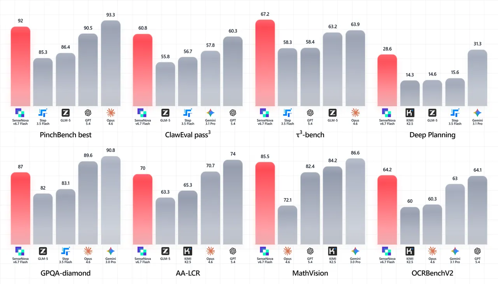
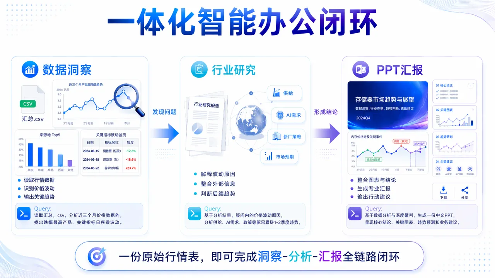
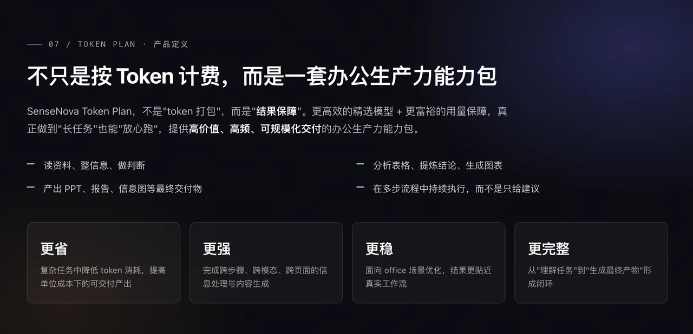

# ⚡ SenseNova 6.7 Flash-Lite

<p align="center">
  
</p>

> 原生多模态的大模型，更懂办公，更省 token

**SenseNova 6.7 Flash-Lite** 是商汤日日新推出的面向真实工作流的轻量多模态智能体模型。采用原生多模态架构，兼顾效果与成本，能够稳定支撑数据分析、PPT 生成、深度调研报告生成、信息图生成等复杂长链路办公任务。

---

## ✨ 核心能力

商汤日日新原生多模态的最新模型，胜任数据分析、深度调研、复杂图片理解、PPT生成等复杂办公任务。现已推出Token Plan，更快、更好、更省。

### 🖼️ 1. 原生多模智能体

为智能体赋予原生视觉能力，让你的Agent与你共享“视界”

### 🔗 2. 更懂企业办公需求

轻松支撑长链路、多步骤的复杂办公任务，数据分析、PPT、深度调研、信息图统统不在话下

### 💰 3. Token 消耗立省 60%

相较于纯文本智能体，在信息搜索等场景下，Token节约60%

> **说明：** 基于长链路复杂任务，对比市面主流最新Agent模型，平均估算所得，根据实际执行任务不同可能存在波动

---

## 📊 性能评测

<p align="center">
  
</p>

---

## 🔥 场景 Showcase

### 🏢 一体化智能办公闭环

以半导体存储市场行业分析为例，模型完整覆盖从数据洞察、行业研究到内容交付的全流程：

**数据洞察 → 行业研究 → 内容交付**

<p align="center">
  
</p>

Agent 在真实办公任务中跑通 "读 → 想 → 做 → 交付" 的全流程，下面是三个典型案例与对应产出物。

#### 📊 数据分析 ｜ 存储芯片报价数据清洗与价格趋势分析

> 💬 **Query**：请读取 `汇总.csv`，对近期的存储芯片报价数据进行清洗和分析。

**🧠 Agent 结论**

近期存储价格整体呈上行趋势，其中部分 DRAM 与 NAND 产品涨幅最明显；上涨节奏上，2 月下旬开始出现拐点，3 月后进入加速阶段；不同品类之间分化明显，服务器相关产品表现强于消费类产品，说明本轮上涨并非全面同步，而是由重点品类率先带动。

📄 [*内存价格数据分析.pdf*](assets/内存价格数据分析.pdf)

---

#### 🔬 深度调研 ｜ 2026 年内存与闪存价格波动主因调研

> 💬 **Query**：基于数据分析结果，调研 2026 年以来内存和闪存价格波动的主要原因。

**🧠 Agent 结论**

本轮价格上涨主要由供给收缩、AI 服务器需求增强以及部分厂商主动控产共同推动；短期看存在情绪和备货带来的波动放大，但中期更像是供需重新平衡下的结构性修复；后续若高端需求持续、原厂延续谨慎供给策略，价格仍有继续上行或高位震荡的可能。

📄 [*内存价格调研.pdf*](assets/内存价格调研.pdf) · Research · Report

---

#### 🎨 PPT 制作 ｜ 15–20 页存储器价格波动分析报告

> 💬 **Query**：生成一份 15–20 页的中文 PPT，主题为 "2026 年存储器价格波动分析与市场趋势判断"。

**🧠 Agent 结论**

最终汇报将形成一条清晰主线：先用数据证明 "价格确实在涨、而且涨幅集中在关键品类"，再用外部研究解释 "为什么涨、背后驱动是什么"，最后给出趋势判断与行动建议，例如重点关注高景气品类、提前锁定采购节奏、持续跟踪原厂策略和下游需求变化。

📄 [*半导体存储市场暴涨分析*](assets/半导体存储市场暴涨分析) · PPT · Showcase

> 💡 **提示**：以上示例能力**必须由 Agent 框架与 Skills 共同提供** —— 仅通过 API 直连模型无法复现完整工作流。
>
> - **推荐方式**：使用我们提供的 [Agent Pack](https://github.com/SenseTime-FVG/agent_pack) 一键安装 Hermes Agent / OpenClaw，安装包**已内置全套 Skills**，开箱即用（详见下方 [🤖 在开源 Agent 框架中使用](#-在开源-agent-框架中使用) 章节）。
> - **自行接入**：如使用其他 Agent 框架，可前往 [OpenSenseNova/SenseNova-Skills](https://github.com/OpenSenseNova/SenseNova-Skills) 单独获取 Skills 并自行安装。

---

## 🚀 快速开始

### API Key 申请

1. 注册并完成实名认证：[https://console.sensecore.cn](https://console.sensecore.cn)
2. 进入控制台左侧导航：**管理中心 → API-Key 管理 → 创建 API-Key**，复制并妥善保存（仅创建时展示一次）
3. 设置环境变量：
   ```bash
   export SENSENOVA_API_KEY="your_api_key_here"
   ```

### ⚡ 发起第一次调用

**curl**

```bash
curl 'https://token.sensenova.cn/v1/chat/completions' \
  -H "Authorization: Bearer $SENSENOVA_API_KEY" \
  -H 'Content-Type: application/json' \
  -d '{
    "model": "sensenova-6.7-flash-lite",
    "max_tokens": 2000,
    "messages": [{"role": "user", "content": "你好，简单介绍一下你自己"}]
  }'
```

---

## 🤖 在开源 Agent 框架中使用

SenseNova 6.7 Flash-Lite 兼容 OpenAI API，可无缝接入主流开源 Agent 框架。

### 🛠️ Hermes Agent 与 OpenClaw

**Hermes Agent** 与 **OpenClaw** 是面向真实办公任务的本地 Agent 框架。

推荐使用官方一键安装包 [SenseTime-FVG/agent_pack](https://github.com/SenseTime-FVG/agent_pack) 完成部署。

安装器会在过程中收集 LLM 凭证，并自动写入配置文件（`~/.hermes/config.yaml` 与 `~/.openclaw/openclaw.json`）。

前往 [Releases 页面](https://github.com/SenseTime-FVG/agent_pack/releases) 下载对应平台安装器（Windows `.exe` / macOS `.pkg` / Linux 脚本）即可开箱即用。

> ⚠️ **需配合 Skills 使用**：Hermes Agent 与 OpenClaw 需配合官方技能库 [OpenSenseNova/SenseNova-Skills](https://github.com/OpenSenseNova/SenseNova-Skills) 使用，以获得完整的办公任务能力。


#### [💻 Windows 详细安装和使用步骤 →](docs/install-windows.md)

#### [🍎 macOS 详细安装和使用步骤 →](docs/install-macos.md)


### 🚀 开始使用

#### Hermes Agent（命令行 AI 助手）

装完之后会直接打开 Hermes 对话终端；如果没有，打开任意终端（Windows 上用 `wsl`，macOS / Linux 用系统终端），直接输入：

```bash
hermes
```

就进入聊天界面了。你可以问它：

- "帮我写一个 Python 脚本，把当前目录下所有 `.jpg` 文件重命名成 `photo-1.jpg`、`photo-2.jpg` ..."
- "这段代码为什么报错？`<粘贴代码>`"
- "帮我查一下 React 18 的最新改动"

想退出，输入 `/exit` 或按 `Ctrl + C`。

#### OpenClaw（网页 UI）

安装完成后，OpenClaw 的网关（gateway）会在后台自动启动，浏览器会自动打开控制台页面，地址大概长这样：

```
http://localhost:18789/#token=xxxxx
```

如果浏览器没自动弹出，可在终端里跑：

```bash
openclaw dashboard
```

在网页上可以：
- 查看所有 AI 对话历史
- 管理 API Key
- 配置不同的模型
- 看各种指标和日志

### [❓ 常见问题 →](docs/faq.md)

#### 📮 反馈与支持

遇到问题或希望提交建议，可通过以下渠道与我们联系：

- **GitHub Issues**：[SenseTime-FVG/agent_pack](https://github.com/SenseTime-FVG/agent_pack/issues) —— 用于报告 Bug 与提交功能建议
- **Hermes 官方文档**：<https://github.com/NousResearch/hermes-agent>
- **OpenClaw 官方文档**：<https://docs.openclaw.ai>

为便于我们快速定位问题，提交 Issue 时请附上以下信息：

1. **操作系统版本**：例如 Windows 11、macOS 14、Ubuntu 22.04
2. **复现步骤**：在哪一步出现问题
3. **完整日志内容**：日志路径参见 [FAQ](docs/faq.md) 中 Q1

---

### [🎓 进阶指南 →](docs/advanced.md)

---

## 💎 Token Plan

**SenseNova Token Plan** 面向复杂知识工作与办公生产场景，不止"用得便宜"，更要"用得安心"——更高效的精选模型配合更充裕的用量保障，真正做到长任务也能放心跑。

| 特性 | 说明 |
|------|------|
| 更省 | 复杂任务 token 消耗大幅降低，提升单位成本交付产出 |
| 更强 | 完成跨步骤、跨模态、跨页面的信息处理与内容生成 |
| 更稳 | 面向 Office 场景优化，结果贴近真实工作流 |
| 更完整 | 从"理解任务"到"生成最终产物"形成闭环 |

<p align="center">
  
</p>

> 最新 SenseNova 6.7 Flash-Lite 模型与全系 cowork-skill 均已加入**小浣熊 Pro 套餐**，提供企业级安全防护与开箱即用的丝滑体验。<!-- TODO: 插入小浣熊产品页链接 -->

<!-- TODO: 插入 Token Plan 购买/了解更多链接 -->

---

## 📚 相关链接

- 官网：[https://platform.sensenova.cn/](https://platform.sensenova.cn/)
- API 文档：[docs/API.md](docs/API.md)
