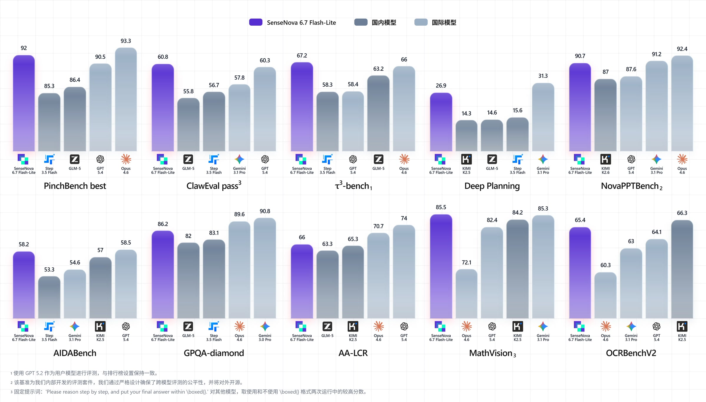
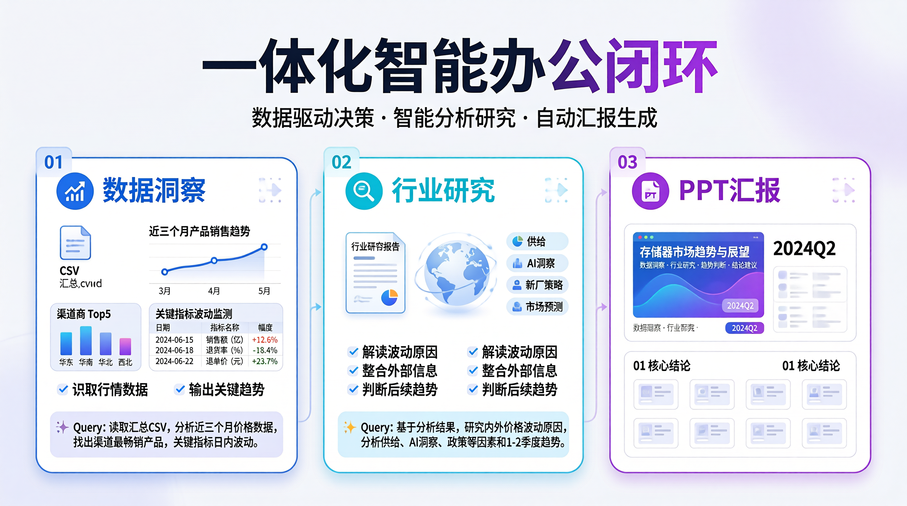
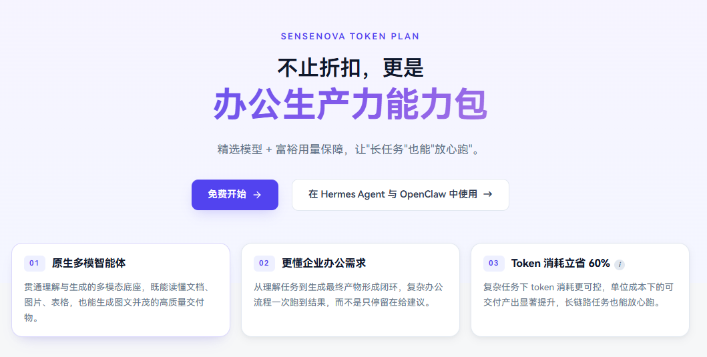

# SenseNova 6.7 Flash-Lite

🌐 [English](README.md) | **中文**

<p align="center">
  <a href="https://platform.sensenova.cn/"></a>
</p>

<p align="center">
  <a href="https://platform.sensenova.cn/"></a>
  <a href="API_CN.md"></a>
  <a href="API_CN.md"></a>
  <a href="https://www.sensenova.cn/token-plan"></a>
  <a href="https://github.com/OpenSenseNova/SenseNova-Skills"></a>
  <a href="https://office.xiaohuanxiong.com/home"></a>
</p>

> 面向真实工作流的轻量多模态智能体模型

**SenseNova 6.7 Flash-Lite** 是商汤日日新推出的面向真实工作流的轻量多模态智能体模型。采用原生多模态架构，兼顾效果与成本，能够稳定支撑数据分析、PPT 生成、深度调研报告生成、信息图生成等复杂长链路办公任务。

---

## 核心能力

**SenseNova 6.7 Flash-Lite** —— 面向真实工作流的轻量多模态智能体模型。

- **轻量高效**，兼顾效果、成本与落地性
- **办公场景增强**，稳定支撑复杂长链路任务
- **原生多模态架构**，适合真实办公内容处理
- **Token 效率更优**，复杂任务成本更可控

---

## 章节目录

- [性能评测](#性能评测)
- [一体化智能办公闭环](#一体化智能办公闭环)
- [快速开始](#快速开始)
- [在 Agent 框架中使用](#在-agent-框架中使用)
- [Token Plan](#token-plan)
- [相关链接](#相关链接)

---

## 性能评测

<p align="center">
  
</p>

SenseNova 6.7 Flash-Lite 多项领先，与同体量模型对比，在长链路任务、规划能力与多模态理解上表现突出。

---

## 一体化智能办公闭环

以半导体存储市场行业分析为例，模型完整覆盖从数据洞察、行业研究到内容交付的全流程：

**数据洞察 → 行业研究 → 内容交付**

<p align="center">
  
</p>

Agent 在真实办公任务中跑通“读 → 想 → 做 → 交付”的全流程，下面是三个典型案例与对应产出物。

#### 第一步 ｜ 数据分析 ｜ 存储芯片报价数据清洗与价格趋势分析

> **Query**：请读取 `汇总.csv`，对近期的存储芯片报价数据进行清洗和分析。

**Agent 结论**

近期存储价格整体呈上行趋势，其中部分 DRAM 与 NAND 产品涨幅最明显；上涨节奏上，2 月下旬开始出现拐点，3 月后进入加速阶段；不同品类之间分化明显，服务器相关产品表现强于消费类产品，说明本轮上涨并非全面同步，而是由重点品类率先带动。

[*内存价格数据分析.pdf*](https://github.com/OpenSenseNova/SenseNova-Skills/blob/main/examples/memory-price-end2end-analysis/README_CN.md#第一步数据分析)

#### 第二步 ｜ 深度调研 ｜ 2026 年内存与闪存价格波动主因调研

> **Query**：基于数据分析结果，调研 2026 年以来内存和闪存价格波动的主要原因。

**Agent 结论**

本轮价格上涨主要由供给收缩、AI 服务器需求增强以及部分厂商主动控产共同推动；短期看存在情绪和备货带来的波动放大，但中期更像是供需重新平衡下的结构性修复；后续若高端需求持续、原厂延续谨慎供给策略，价格仍有继续上行或高位震荡的可能。

[*内存价格调研.pdf*](https://github.com/OpenSenseNova/SenseNova-Skills/blob/main/examples/memory-price-end2end-analysis/README_CN.md#第二步深度调研) · Research · Report

#### 第三步 ｜ PPT 制作 ｜ 15–20 页存储器价格波动分析报告

> **Query**：生成一份 15–20 页的中文 PPT，主题为“2026 年存储器价格波动分析与市场趋势判断”。

**Agent 结论**

最终汇报将形成一条清晰主线：先用数据证明“价格确实在涨、而且涨幅集中在关键品类”，再用外部研究解释“为什么涨、背后驱动是什么”，最后给出趋势判断与行动建议，例如重点关注高景气品类、提前锁定采购节奏、持续跟踪原厂策略和下游需求变化。

[*半导体存储市场暴涨分析*](https://github.com/OpenSenseNova/SenseNova-Skills/blob/main/examples/memory-price-end2end-analysis/README_CN.md#第三步生成-ppt) · PPT · Showcase

> **提示**：以上示例能力**必须由 Agent 框架与 Skills 共同提供** —— 仅通过 API 直连模型无法复现完整工作流。
>
> - **推荐方式**：搭配 [OpenClaw](https://openclaw.ai/) 或 [hermes-agent](https://github.com/NousResearch/hermes-agent) 框架，并安装 [OpenSenseNova/SenseNova-Skills](https://github.com/OpenSenseNova/SenseNova-Skills) 中的官方技能库（详见下方 [在 Agent 框架中使用](#在-agent-框架中使用) 章节）。
> - **自行接入**：如使用其他 Agent 框架，同样可前往 [OpenSenseNova/SenseNova-Skills](https://github.com/OpenSenseNova/SenseNova-Skills) 单独获取 Skills 并自行安装。

---

## 快速开始

### API Key 申请

1. 注册并完成实名认证：[https://platform.sensenova.cn/console](https://platform.sensenova.cn/console)
2. 进入控制台左侧导航：**管理中心 → API-Key 管理 → 创建 API-Key**，复制并妥善保存（仅创建时展示一次）
3. 设置环境变量：
   ```bash
   export SENSENOVA_API_KEY="your_api_key_here"
   ```

### 简单测试：发起第一次调用

```bash
curl 'https://token.sensenova.cn/v1/chat/completions' \
  -H "Authorization: Bearer $SENSENOVA_API_KEY" \
  -H 'Content-Type: application/json' \
  -d '{
    "model": "sensenova-6.7-flash-lite",
    "max_tokens": 2000,
    "messages": [{"role": "user", "content": "你好，简单介绍一下你自己"}]
  }'
```

> 完整的 API 文档（多轮对话、多模态输入、流式输出、OpenAI SDK、错误码等）请参见 [API_CN.md](API_CN.md)。

---

## 在 Agent 框架中使用

SenseNova 6.7 Flash-Lite 需要与 **Agent 运行时** + **官方技能库** 协同工作，才能跑通完整的办公任务闭环。

- **推荐运行时**：**[OpenClaw](https://openclaw.ai/)** 或 **[hermes-agent](https://github.com/NousResearch/hermes-agent)**。
- **推荐 LLM**：配合 **[SenseNova 平台 API](https://platform.sensenova.cn/token-plan)** 使用（提供免费 token 套餐）。
- **安装与配置**：详见 [SenseNova-Skills INSTALL_CN.md](https://github.com/OpenSenseNova/SenseNova-Skills/blob/main/INSTALL_CN.md)。

### 安装 SenseNova-Skills

**推荐做法：直接让 agent 帮你装好这些 skill。** 把仓库地址交给它，让它自己克隆并把内容拷贝到目标目录，例如：

> *“请帮我把 https://github.com/OpenSenseNova/SenseNova-Skills 安装到你的 skills 目录。”*

安装完成后，**可能需要手动重启 agent 服务**，新 skill 才会被加载。

| 智能体 | 目标目录 |
|--------|---------|
| [OpenClaw](https://openclaw.ai/) | `~/.openclaw/skills/` |
| [hermes-agent](https://github.com/NousResearch/hermes-agent) | `~/.hermes/skills/` |

<details>
<summary>想手动安装？</summary>

克隆本仓库，然后把 `skills/` 下的子目录自行复制（或软链接）到目标目录：

```bash
git clone https://github.com/OpenSenseNova/SenseNova-Skills.git --depth=1
mkdir -p ~/.openclaw/skills
cp -r SenseNova-Skills/skills/* ~/.openclaw/skills/
```

Hermes 把目录换成 `~/.hermes/skills/` 即可。

</details>

---

## 🦝 在小浣熊中开箱即用

本仓库的最新模型与全系 Cowork-Skill，已整体集成进 [**小浣熊**](https://office.xiaohuanxiong.com/home)，提供企业级安全防护与开箱即用的丝滑体验，**完全免费使用**——如果你不想自己搭环境、配 API key，可以直接通过小浣熊使用这些能力。

小浣熊本次迎来产品能力与客户端体验的全面升级：

- **三大核心办公能力全面增强**：依托 SenseNova 6.7 Flash 与 Cowork-Skill，数据分析、PPT 生成、任务规划进一步强化，覆盖多文件清洗分析、正式汇报 PPT、行业研究 / 竞品分析 / 投研报告等复杂知识工作的完整闭环。
- **新增信息图生成功能**：基于 SenseNova U1 模型，将复杂数据、长篇报告与业务洞察压缩为高密度、结构化、视觉化的信息图，让复杂内容更易理解、更适合传播。
- **全新客户端 + 本地 Agent OS**：云端模型负责复杂推理与多模态理解，本地 Agent OS 围绕本地文件、工作上下文与个人使用习惯，带来更个性化、本地化、安全化的 AI 原生办公体验。
- **规模化验证**：1500 万个人用户、数千家企业用户的共同选择。

> 👉 立即体验：[office.xiaohuanxiong.com/home](https://office.xiaohuanxiong.com/home)

---

## Token Plan

**不止折扣，更是办公生产力能力包**

**SenseNova Token Plan**，不止“用得便宜”，更要“用得安心”。我们提供更高效的精选模型 + 更富裕的用量保障，真正做到“长任务”也能“放心跑”，实现高价值、高频、可规模化交付的办公生产力能力包。

**01 · 原生多模智能体**

贯通理解与生成的多模态底座，既能读懂文档、图片、表格，也能生成图文并茂的高质量交付物。

**02 · 更懂企业办公需求**

从“理解任务”到“生成最终产物”形成闭环，复杂办公流程一次跑到结果，而不是只停留在给建议。

**03 · Token 消耗立省 60%**

复杂任务下 token 消耗更可控，单位成本下的可交付产出显著提升，长链路任务也能“放心跑”。

<p align="center">
  <a href="https://www.sensenova.cn/token-plan"></a>
</p>

#### [查看详情 →](https://www.sensenova.cn/token-plan)

---

## Join the Community!

在接入 SenseNova 6.7 Flash-Lite 或使用 Skills 过程中遇到问题？想分享真实工作流的玩法、提需求、报 bug？扫描下方二维码加入 SenseNova Skills 企业微信交流群——团队会在群里提供技术支持、收集反馈，并根据大家的建议持续迭代产品。

<p align="center">
  
</p>

---

## 相关链接

- 官网：[https://platform.sensenova.cn/](https://platform.sensenova.cn/)
- API 文档：[API_CN.md](API_CN.md)
- 小浣熊： [office.xiaohuanxiong.com/home](https://office.xiaohuanxiong.com/home)
