# 🍎 macOS Install Guide — Hermes Agent / OpenClaw

🌐 **English** | [中文](install-macos.md)

This guide walks through installing **Hermes Agent** and **OpenClaw** on macOS via [Agent Pack](https://github.com/SenseTime-FVG/agent_pack).

---

## 1. Install prerequisites

> Only needs to be done once.

1. In Spotlight or Launchpad, search for `terminal` and open **Terminal**.

   <p align="center">
     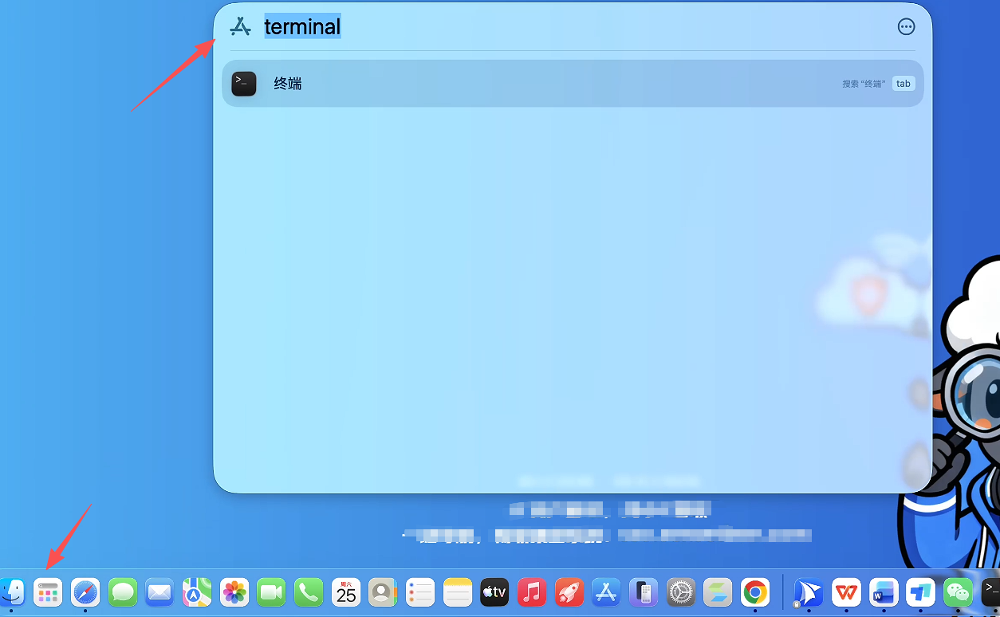
   </p>

2. In the terminal, copy-paste and run each of the following commands in turn:

   ```bash
   xcode-select --install
   ```

   ```bash
   /bin/bash -c "$(curl -fsSL https://raw.githubusercontent.com/Homebrew/install/HEAD/install.sh)"
   ```

   Follow the prompts and press Return to continue.

   <p align="center">
     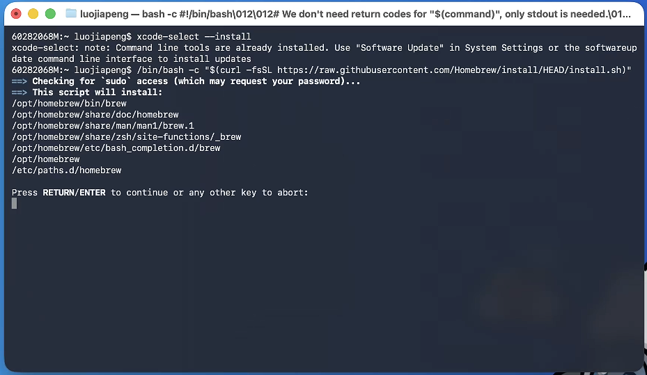
   </p>

3. When this finishes, move on to the **Install Agent Pack** stage.

   <p align="center">
     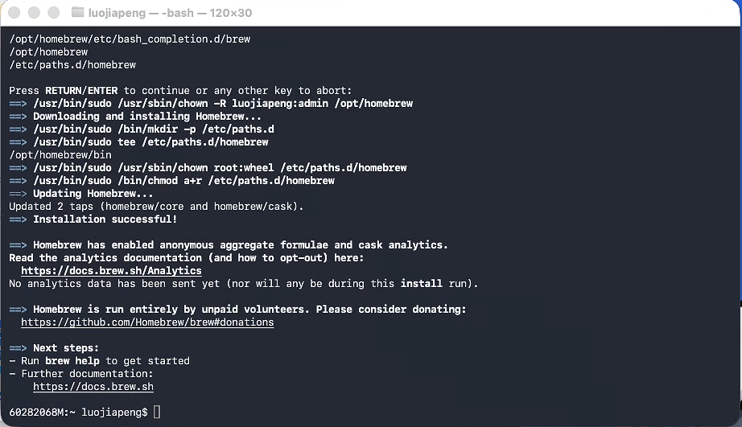
   </p>

---

## 2. Install Agent Pack

1. Download the installer: [AgentPack-1.0.10-macos-universal.pkg](https://github.com/SenseTime-FVG/agent_pack/releases/download/v1.0.10/AgentPack-1.0.10-macos-universal.pkg) and open it.

   > ⚠️ **If you hit a privacy / security warning**: go to **System Settings → Privacy & Security → Security**, where you'll see an "**Open / Open Anyway**" button for the app. The button typically only appears for about an hour after your first attempt to open the app. Enter your login password to allow it; from then on it'll be remembered as an exception.

2. Open the installer.

   <p align="center">
     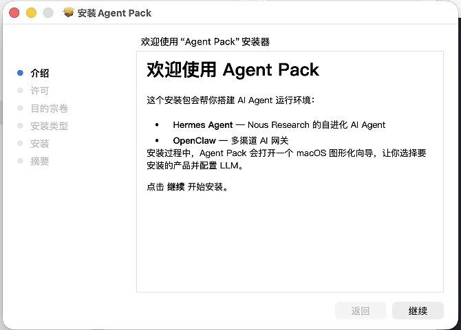
   </p>

   Click **Continue** through each step. You may be prompted for your user password along the way.

3. The installer asks which agents to install. **We recommend selecting just one at a time.** This example uses **OpenClaw**.

   <p align="center">
     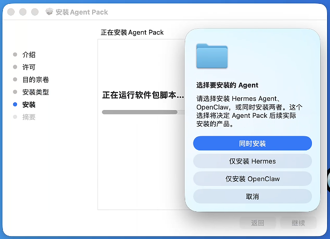
   </p>

4. When prompted to choose an LLM provider, pick **Custom Endpoint** and enter:

   ```
   https://token.sensenova.cn/v1
   ```

   <p align="center">
     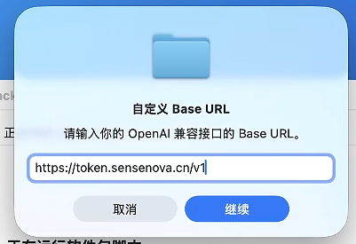
   </p>

5. Enter the model ID: `sensenova-6.7-flash-lite`

   <p align="center">
     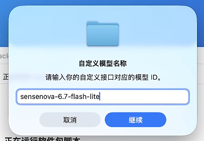
   </p>

6. Enter the API key: `sk-*********`

   <p align="center">
     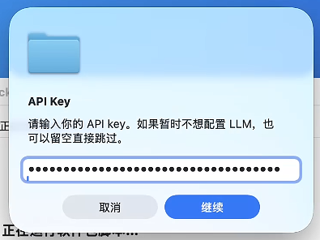
   </p>

7. Verify the configuration. (A failed verification is fine — it can happen when the system is missing verification components.)

   <p align="center">
     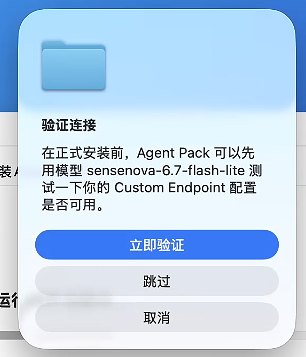
     &nbsp;&nbsp;
     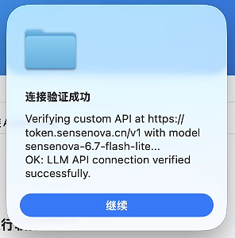
   </p>

8. Click **Start Install**.

   <p align="center">
     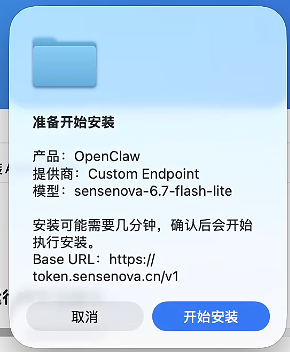
   </p>

9. Allow **Terminal control**.

   <p align="center">
     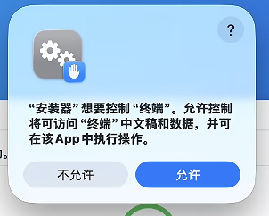
   </p>

10. A Terminal window pops up — wait for the install to complete.

    <p align="center">
      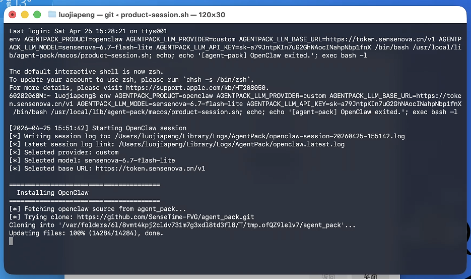
    </p>

11. The OpenClaw dashboard opens automatically.

    <p align="center">
      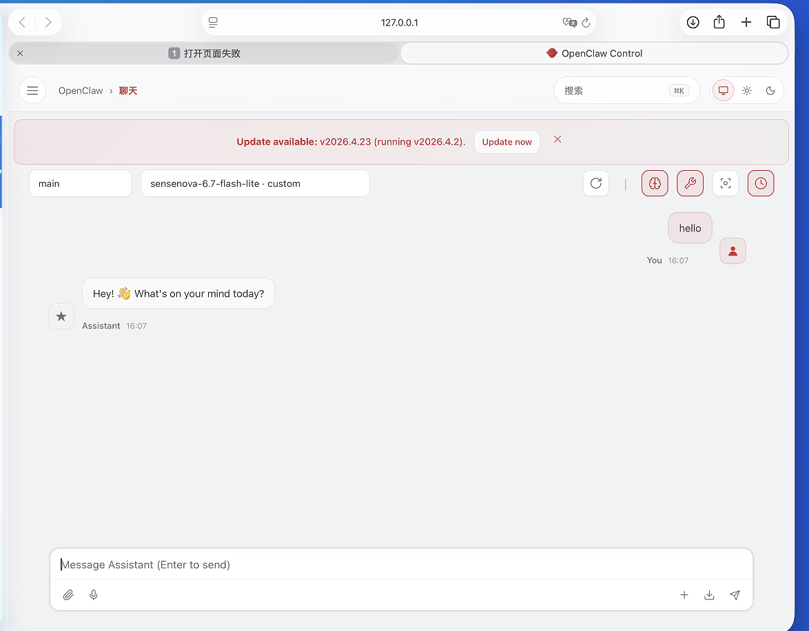
    </p>

---

## Next steps

Once installation finishes, head back to the main README to see the [Getting Started](../README_EN.md#-getting-started), [FAQ](../README_EN.md#-faq-), and [Feedback & Support](../README_EN.md#-feedback--support) sections.
