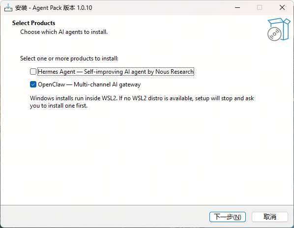
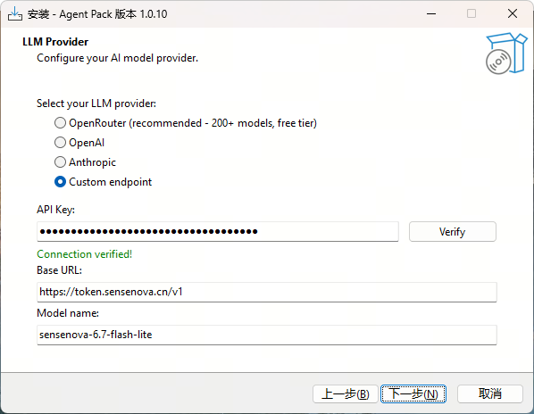
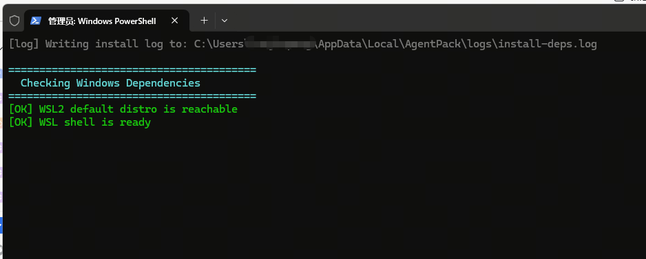
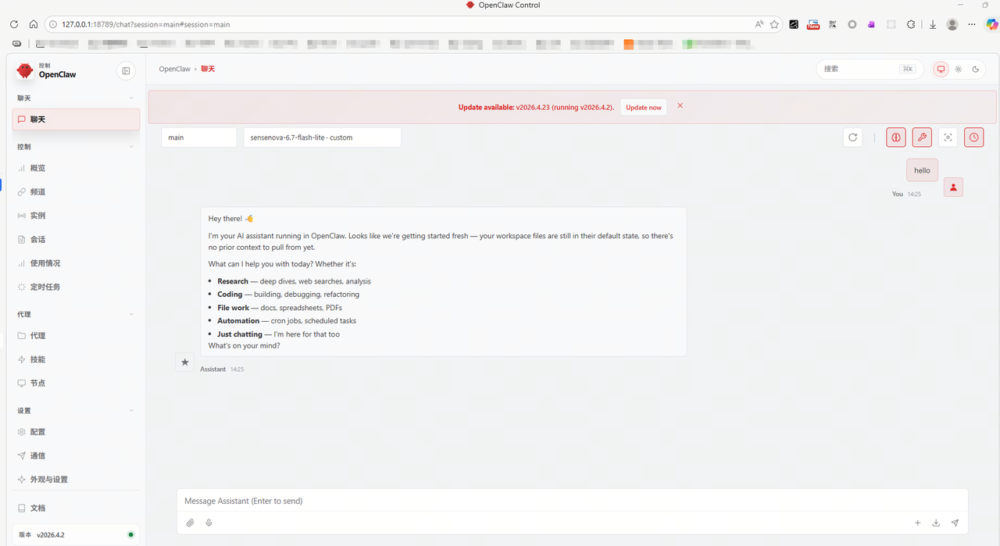

# 🪟 Windows 安装指南 — Hermes Agent / OpenClaw

本文档介绍在 Windows 上通过 [Agent Pack](https://github.com/SenseTime-FVG/agent_pack) 安装 **Hermes Agent** 与 **OpenClaw** 的完整步骤。

---

## 1. 先装 WSL2（只需要一次）

WSL2 是微软给 Windows 自带的一个 "Linux 容器"，Agent Pack 底层需要它。

1. 按下 `Win` 键，输入 `cmd`
2. 在搜索结果上右键，选 **"以管理员身份运行"**（这一步很重要）
3. 在打开的黑色窗口里粘贴：

   ```powershell
   wsl --install
   ```

4. 按回车，等它装完（几分钟）

   👉 这一步会自动完成：
   - 启用 WSL 功能
   - 安装虚拟机平台
   - 安装 Linux 内核
   - 默认安装 Ubuntu

5. 重启电脑
6. 重启后 Windows 会自动弹出一个窗口让你设 Ubuntu 的用户名和密码 —— 可以不用设置

---

## 2. 安装 Agent Pack

1. 下载安装包：[AgentPack-1.0.10-windows-x64.exe](https://github.com/SenseTime-FVG/agent_pack/releases/download/v1.0.10/AgentPack-1.0.10-windows-x64.exe)
2. 双击打开安装程序
3. 选择安装 **Hermes** 或 **OpenClaw**（一次只选一个）

   <p align="center">
     
   </p>

4. 填入语言模型配置

   > ⚠️ `verify` 可能由于系统缺少组件导致失败，没有关系，可继续下一步。

   <p align="center">
     
   </p>

5. 点击 **下一步** 之后进入安装

---

## 3. 启动安装

1. 自动弹出 `cmd` 界面，开始执行安装脚本

   <p align="center">
     
   </p>

2. 安装完成

   <p align="center">
     
   </p>

---

## 下一步

安装完成后，请返回主 README 查看 [开始使用](../README.md#-开始使用)、[常见问题](../README.md#-常见问题) 与 [反馈与支持](../README.md#-反馈与支持) 章节。
